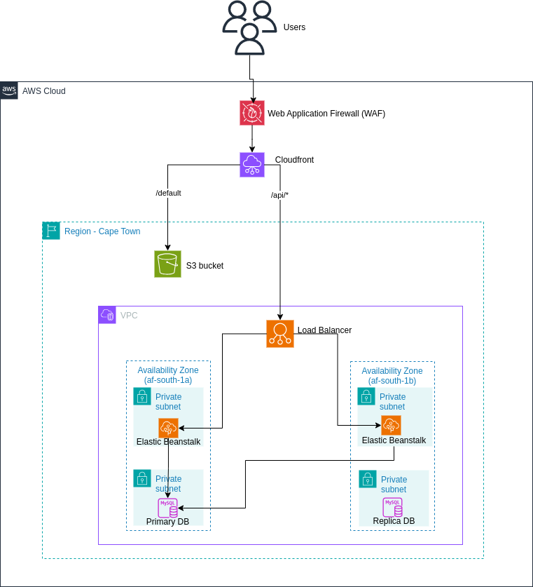

# MCP-TRIVIA

### **AWS Architecture Diagram**

### **Architecture Overview**

1. **Frontend (React Application)**
   - **Deployment**: Hosted on AWS S3.
   - **Content Delivery**: Delivered via AWS CloudFront, which is a CDN (Content Delivery Network) that caches and distributes the static content globally to improve performance and reduce latency.

2. **Backend (Flask Application)**
   - **Deployment**: Deployed on AWS Elastic Beanstalk using Docker. Elastic Beanstalk handles deployment, scaling, and monitoring of the Flask application.
   - **Containerization**: Docker is used to containerize the Flask application, allowing for easy deployment and consistency across different environments.

3. **Storage (MySQL Database)**
   - **Database**: A MySQL database is used to store data.
   - **Connectivity**: The Flask backend interacts with the MySQL database to perform CRUD operations (Create, Read, Update, Delete).

